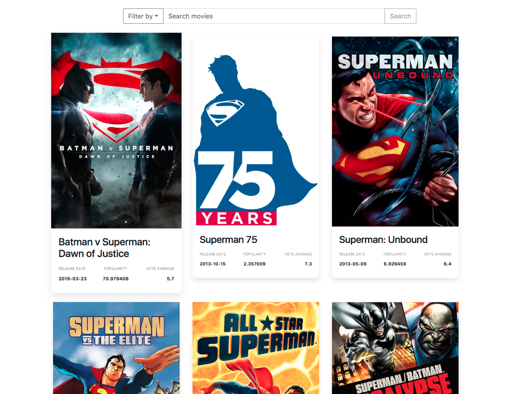

# This is another R&R  Application wich fetching data from the
*[https://www.themoviedb.org/](https://www.themoviedb.org/)*



## Prerequisite

This project requires an API key from [The Movie Database.](https://goo.gl/Sq896Q) Get your API key [here.](https://goo.gl/kb7y78)

Create a .env file in the project's root directory and specify your key as below

```ruby
  API_URL='https://api.themoviedb.org/3'
  API_KEY=XXXXXXXXXXXXXXXXXXXX
  RAILS_ENV=development
```

## Built With

* Ruby on Rails - The Ruby web framework
* Twitter Bootstrap

### Run

```ruby
  bundle install && gem install foreman
  foreman start -f Procfile.dev
```

### start forman with hot reload

```ruby
  foreman start -f Procfile.dev-server
```

### TODO

* [ ] Create and endpoint for a movie to show its full detail
* [ ] Add test only few added
* [ ] reverse list year from dorpdown

### Next

* [x] ReactJS to render cards
* [ ] Comments
